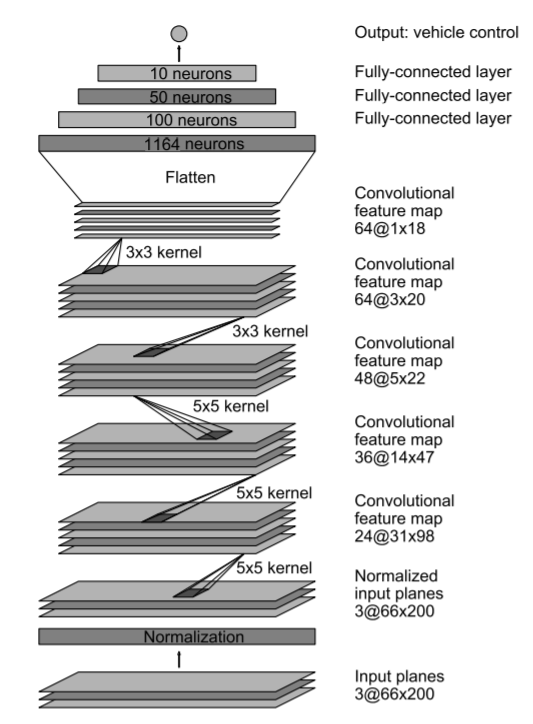

<h1 align="center">Self driving car</h1>

## Introduction

The problem of fully autonomous cars is interesting but complex as a whole. The first step towards solving this problem is to get comfortable steering the car. We can do this by predicting the steering angle given a sequence of images or a video.

## Dataset

The dataset consists of 45,406 images from a camcorder in a real car ride. The data.txt file contains the steering angle for each image.

> Credits: [Sully Chen](https://github.com/SullyChen/driving-datasets)

## The model

This project is a keras implementation of DAVE-2 model from this [Nvidia paper](https://arxiv.org/pdf/1604.07316.pdf).

 

   
  Model architecture

## Demo
 

